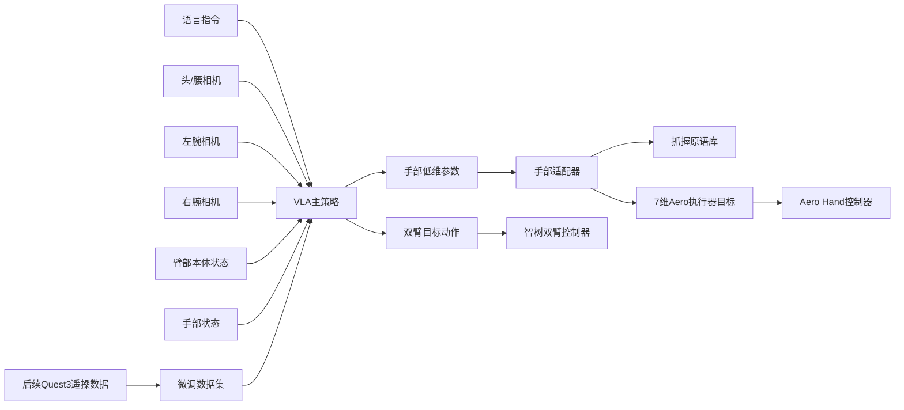

# 7DoF双臂加双灵巧手平台的VLA落地调研报告

## 执行摘要

对你这套“7DoF 双臂 + 两只灵巧手 + 双腕相机 + 头/腰相机”的平台，当前最关键的结论不是“哪一个 VLA 最强”，而是“哪一个方案最先能跑通、并且能平滑过渡到真机”。基于对来自 entity["company","TetherIA","robot hand maker"] 的 Aero Hand Open 接口、来自 entity["company","Physical Intelligence","robot ai startup"] 的 OpenPI 仓库、以及多套双臂/灵巧手 VLA 项目页与官方文档的梳理，我的判断是：**最快落地路径不是直接做“全高维双手端到端 VLA”，而是先把灵巧手压缩成“夹爪式或少量抓握原语”，复用 OpenPI / OpenVLA 这一类成熟工程栈，在 Isaac 里尽快打通抓取、放置、双手协作持物；与此同时，再并行准备保留 7 维手部动作的中期路线，优先看 RDT-1B 与 DexVLA。** 这样做能把“模型适配难题”拆成“先通主链路，再逐步放开手部自由度”，明显更符合“落地第一位”的目标。citeturn11search2turn14view0turn16view0turn17view0turn40view0turn31search12

对你现有传感器，**默认推荐的三视角组合是：头/腰部全局视角 + 左腕相机 + 右腕相机**。这个组合和 OpenPI 在 ALOHA/DROID 路线上已经验证过的“三图像槽位”形式天然兼容：`base_0_rgb`、`left_wrist_0_rgb`、`right_wrist_0_rgb`；缺失视角还能用 mask/零图像补齐。更重要的是，这也与 π0.5 系列“人到机器人迁移”工作里采用的“头戴视角 + 左右腕视角”采集范式高度一致，因此你之后用 Quest 3 做遥操作采集真机数据时，不需要彻底推翻当前相机布局。citeturn29view0turn30view0turn21search1

如果把目标分成“最快仿真跑通”和“最终保留灵巧手能力”两条线，那么我给出的优先级是：**近期首选 OpenPI π0.5 + 手部原语适配器；中期首选 RDT-1B 作为全高维双手动作主线；长期重点跟踪 DexVLA 与 Xiaomi-Robotics-0 这类兼顾跨本体泛化和高维连续动作的方案。** GR-Dexter 和 DexGraspVLA 很值得参考，但前者更像“领先实践样板”，公开工程闭环还不如 OpenPI / RDT / OpenVLA 完整；后者更适合作为“手部子策略”而不是你现在就拿来替代全身 VLA 的总控。citeturn16view0turn40view0turn31search12turn40view3turn31search15turn35search2turn36search14

你现在最大的工程阻塞，其实不是模型权重，而是**动作空间与仿真保真度**。Aero Hand Open 机械上是 16 关节、7 主动 DoF、强耦合的欠驱动腱驱手；官方已经给出了 SDK、ROS 2、MuJoCo Menagerie/MuJoCo Playground 路线，但官方文档也明确写了“其他仿真平台支持仍在进行中”。这意味着：如果你坚持在 Isaac 5.1 里一开始就完整复刻腱驱、滑轮、弹簧、拇指耦合，那么“仿真适配”本身会先成为瓶颈。相反，若先在 Isaac 中使用“夹爪化/原语化”的手部近似，再把真实 Aero Hand 的 7 通道执行映射留给控制适配层，落地速度会更快。citeturn11search1turn14view0turn15view0turn7view0

## 平台约束与适配前提

从控制角度看，你的平台天然有两种动作表示。第一种是**真实执行表示**：按你给定的双臂各 7DoF，再叠加 Aero Hand 每手 7 个主动通道，整机是 **14 维臂部 + 14 维手部 = 28 维主动控制量**。第二种是**描述性表示**：Aero Hand 每手虽然只靠 7 个执行器驱动，但 SDK/ROS 2 同时支持每手 16 关节的显式关节表示，因此如果把双手都展开到关节空间，配上双臂，总表征维度会接近 **14 + 16×2 = 46 维**；只是这里的手部 32 维并不是真正独立可控，而是需要通过耦合映射回到 14 个实际执行通道。这个区别非常关键，因为很多 VLA 论文里的“动作维度”只是训练表示，不等于硬件真实控制接口。citeturn11search2turn14view0turn15view0turn7view0

对工程落地而言，我建议你**始终同时保留两套表示**：训练/部署主链路优先使用“28 维主动控制表示”或者它的低维近似；数据日志中再额外保存“46 维展开关节表示”作为分析与可视化通道。这样做的好处是，短期内你可以把手部压缩成夹爪/原语去复用成熟 VLA；中期如果要切换到高维双手策略，也不需要重做全部数据协议，只需要换输出变换与归一化统计。这个分层会显著降低系统演进成本。其依据在于 Aero Hand 的 `set_joint_positions()` 本身就允许输入 16 关节或 7 维 compact joint，而底层再自动映射到 7 个执行器。citeturn14view0turn15view0

相机方面，你现在的腕部相机是“固定接在手掌上、随手掌动、看得到手心和五指”的布局，这对灵巧手是好事，因为它天然提供了接触前最后一段的近距信息；但弱点也很明显：手指和物体会互相遮挡，而且当双手靠近时，单腕画面很容易丢失全局上下文。也因此，**双腕视角适合近场抓取、对位、双手协同接触；头/腰视角适合找物、粗对齐、语言消歧和失败恢复。** 你后面如果做“扫码枪在一手、物体在另一手”，几乎必然需要一个较高的全局相机来维持两手之间的宏观几何关系。这个判断和 OpenPI/ALOHA、π0.5+ego 的公开相机使用方式是一致的。citeturn29view0turn30view0turn21search1

## Aero Hand Open 接口与 Isaac 仿真适配难点

先说最重要的接口事实。Aero Hand Open 官方文档将其描述为 **7-DoF、tendon-driven、5 指 anthropomorphic hand**，机械总计 16 个关节、7 个主动通道、9 个被动/欠驱动关节；两只左右手共享同一套控制 API。SDK 支持两类主接口：一类是 `set_joint_positions()`，可接收 16 维完整关节角，也可接收 7 维 compact joint；另一类是 `set_actuations()`，直接下发 7 个执行器位置。观测侧则提供 7 维执行器位置、电流、温度、转速等 getter。citeturn11search2turn14view0

Aero Hand 的 7 维 compact joint 具体是：拇指外展、拇指 CMC 屈曲、拇指 MCP/IP 联动，以及食/中/无名/小指四根手指各一条联动通道。官方文档还明确给出了 actuator 索引，分别对应 `thumb_cmc_abd_act`、`thumb_cmc_flex_act`、`thumb_tendon_act` 和四根手指的 tendon actuator；其中拇指三路互相耦合很强，单独改一个执行器会影响多个拇指关节。仓库中的 `joints_to_actuations.py` 也直接公开了从 16 关节角到 7 执行器位移的线性近似模型，包括各指的系数、拇指耦合项和电机滑轮半径。对工程适配来说，这意味着你其实已经拥有一条可用的“手部低维控制抽象层”，不必一开始就把模型直接对准 16 个手部关节。citeturn14view0turn15view0

ROS 2 接口也很清楚。官方 `aero_hand_node.py` 默认串口波特率 921600、反馈频率 100 Hz，可在 `joint` 和 `actuator` 两种控制空间间切换；`JointControl` 期望每手 16 个目标关节位置，`ActuatorControl` 期望每手 7 个执行器位置，状态发布话题会给出 `actuations`、`actuator_speeds`、`actuator_currents`、`actuator_temperatures`。这基本足够你把灵巧手封装成“独立 ROS 2 driver + 上层策略适配器”的结构，与智树双臂本体解耦。citeturn7view0

仿真上，官方今天最成熟的路线不是 Isaac，而是 **MuJoCo Menagerie + MuJoCo Playground**。文档明确写了：Aero Hand Open 在 MuJoCo 中已经“full tendon-space control and observation interface”，并且 TetherIA 的实现已经合入 MuJoCo Playground 指定 commit；与此同时，文档也明确说“additional simulation platforms is currently in progress”。这意味着：**若目标是“最短时间验证手部动力学与策略可跑通”，MuJoCo 对 Aero Hand 的支持显著领先于 Isaac。**citeturn11search1

因此，在 Isaac 5.1 上你会遇到四个难点。其一，Aero Hand 的腱、滑轮、弹簧、拇指耦合在 MuJoCo 文档里是显式建模的，而 Isaac 里若想复现到同等精度，工作量不会小。其二，Aero Hand 真正自然的控制空间是“7 执行器/腱空间”，而很多通用 VLA 与仿真示例更习惯把末端当成平行夹爪。其三，你的腕部相机跟着手掌走，双手接近时自遮挡会比普通 gripper 系统严重。其四，手和臂来自不同厂家，时序、坐标系、控制周期、饱和与安全策略都要自己统一。综合来看，**Isaac 上最快的做法不是硬复刻腱驱，而是先做手部近似模型，保留真实 AERO 手的 7 通道映射到下层控制器。** 这不是退而求其次，而是为了尽快把 VLA 主链路跑起来。citeturn11search1turn14view0turn15view0turn7view0

## OpenPI 中 pi0 与 pi0.5 的工程深读

OpenPI 仓库当前公开了三类模型：`π0`、`π0-FAST`、`π0.5`。README 明确写到：`π0` 是 flow-based VLA，`π0-FAST` 是基于 FAST action tokenizer 的自回归 VLA，`π0.5` 是带更强 open-world generalization 的升级版；但对 `π0.5`，**当前开源仓库只支持 flow-matching head 的训练和推理**，并没有把论文里完整的所有头都一并开出来。仓库给出的硬件下限也比较实用：单卡推理需要 **8GB 以上显存**，LoRA 微调约 **22.5GB 以上**，全量微调约 **70GB 以上**。citeturn16view0turn26search2

从动作空间定义上看，OpenPI 的“公开预训练语义”仍然是典型的**夹爪式机器人语义**。`norm_stats.md` 给出的标准定义里，Pi 系列的动作空间按“关节角 + gripper position”组织；对于 7DoF 单臂机器人，前 7 维是关节动作，第 8 维是 gripper；双臂则左右臂各占一段，移动底盘还有额外底盘速度维。gripper 的取值定义为 `[0,1]`，`0` 全开，`1` 全闭。换句话说，**在公开资产层面，Pi 系列并没有现成的“多指手语义规范”。** 这点对你非常重要：如果拿现成 `pi05_droid` 直接套，你面对的不是“如何改一两维”，而是“如何把平行夹爪式先验改造成灵巧手式先验”。citeturn17view0

但代码层面，OpenPI 又给了你一个可扩展入口。`Pi0Config` 的默认内部配置是 `action_dim=32`、`action_horizon=50`；当 `pi05=True` 时，`discrete_state_input` 默认也会切到 true，`max_token_len` 默认变成 200。也就是说，**模型内部并不是被死锁在 8 维或 14 维动作上，动作维数本身是可配的。** 只是公开的 DROID、ALOHA、LIBERO 配置和 norm stats，都是围绕现有 gripper 平台整理好的。仓库还给出 `pi05_full_droid_finetune` / `pi05_droid_finetune`，其中 DROID 细化配置使用了 `action_dim=32`、`action_horizon=16`，并在注释里明确写了“pi05 is trained with 32-dim actions”。这再次说明：**Pi 系列内部动作头是泛化的，但你需要自己定义到智树双臂 + Aero 手的输入输出变换和归一化。**citeturn29view1turn24view0turn27search2

输入模态方面，OpenPI 对你这套传感器很友好。`droid_policy.py` 显示，DROID 路线把一个外部视角 `observation/exterior_image_1_left`、一个腕部视角 `observation/wrist_image_left` 和 `joint_position + gripper_position` 打包进内部统一格式；对于 `PI0/PI05`，它们会被映射成三张图像槽位 `base_0_rgb`、`left_wrist_0_rgb`、`right_wrist_0_rgb`，其中缺失的第三张直接用零图和 mask 处理。`aloha_policy.py` 则更进一步，显式用到 `cam_high`、`cam_left_wrist`、`cam_right_wrist` 三个视角，以及 14 维双臂状态，并把输出裁切成前 14 维动作。对你来说，这意味着**头/腰部相机 + 左右腕相机**会是最顺手的 OpenPI 映射方案。citeturn29view0turn30view0

训练与推理接口上，OpenPI 的工程完成度是目前最适合“立刻做适配”的。README 给出了极简 `policy.infer(example)["actions"]` 的本地调用方式，也提供了 `serve_policy.py` 的远程推理服务做法；数据侧则统一走 LeRobot 数据格式，官方示例覆盖了 LIBERO、ALOHA、DROID，并提供了把自定义数据转成 LeRobot 的示例脚本。对于你这种“先仿真、后 Quest 3 真机遥操采集”的路线，这是非常重要的，因为你不需要自己重新造一整套训练服务框架。citeturn16view0turn24view0

### pi0 与 pi0.5 的关键工程点

| 维度 | pi0 | pi0.5 | 对你平台的含义 |
|---|---|---|---|
| 开源状态 | 仓库完整支持训练/推理。 | 仓库已开源，但当前只支持 flow-matching head。 | pi0.5 语言泛化更强，但工程上别假设论文全部功能都现成可用。 citeturn16view0turn26search2 |
| 公开动作语义 | 公开 norm stats/示例以关节+夹爪为主。 | 同样依赖已有 embodiments 的动作统计；DROID 路线用 32 维内部动作。 | 复用时最难的不是模型骨干，而是把灵巧手动作重新定义并配 norm stats。 citeturn17view0turn24view0turn27search2 |
| 视觉输入 | 支持 base + 双 wrist 统一三图槽位。 | 同。 | 你现有的双腕相机和头/腰相机可直接映射。 citeturn29view0turn30view0 |
| 状态输入 | 连续 state 输入。 | 默认把 state 作为离散 token 输入。 | pi0.5 在高层泛化上更强，但数据预处理与 token 长度更敏感。 citeturn29view1 |
| 已有部署文档 | DROID、ALOHA、LIBERO、远程推理都有官方示例。 | 同。 | 这是它相对 Dex-hand 新模型最大的工程优势。 citeturn16view0turn24view0 |
| 算力门槛 | 推理 >8GB；LoRA >22.5GB；全量 >70GB。 | 同仓库下同一门槛说明。 | 在“无特定预算”前提下，这是最容易先试起来的一档。 citeturn16view0 |

### 将灵巧手简化为夹爪复用 OpenPI 的可行性与代价

**可行，而且是当前最务实的近路。** 原因有三。第一，OpenPI 的公开先验本来就是 gripper-centric；第二，Aero Hand 已经内置了从 16 关节到 7 执行器的映射和 7 维 compact joint 表示；第三，你现在计划先在仿真跑通，而不是立刻追求高难度的 in-hand dexterity。把每只手先压缩成“开合标量”或“少量抓握原语”，能最大程度复用现成的 OpenPI 数据协议、相机槽位、推理服务与微调脚本。citeturn17view0turn14view0turn15view0turn16view0

但“简化为夹爪”有两个层次，代价完全不同。**如果你把每只手真的压成单一开合标量**，那适用任务主要是抓取、放置、搬运、双手托举和少量工具持握，代价是丢掉拇指外展、三指捏持、形状顺应和重抓取能力；对“拿扫码枪并稳定扣动/维持姿态”这类任务，除非扫码枪做了专门的机械夹具，不然很容易被限制住。**如果你压缩成“标量 + 抓握原语”**，比如每手提供 `power / pinch / tripod / hook / scanner_hold` 这类离散模式，再由下层控制器把模式映射到 Aero Hand 的 7 维 compact joint 或 7 维 actuator 目标，那么任务覆盖会明显更好，而且仍能留在 OpenPI 友好的动作范式里。这个方案我认为是你当前阶段最平衡的方案。其本质不是放弃灵巧手，而是把灵巧能力从“端到端连续输出”变成“局部技能库 + 上层策略调用”。citeturn14view0turn15view0turn17view0

比“单纯夹爪化”更好的替代方案有两个。其一是**动作映射**：VLA 只输出双臂动作和较低维的手部参数，下层 hand adapter 再展开到 7 通道。其二是**分层控制**：高层 VLA 控臂和决定“抓什么、用哪种手型、何时交接”，低层单独用 wrist-camera hand policy 解决最后几厘米的手部闭环。这个分层路线与 DexGraspVLA 这类“把 dexterous grasping 当成专门子问题”的思路更一致，也更符合你未来 Quest 3 采集真机演示的节奏。citeturn36search14turn35search2

## 候选 VLA 模型对比

下面这张表不只是“论文排行”，而是按你这套配置的**工程适配性**来看的。

| 模型 | 建议输入模态 | 输出动作空间 | 多臂/多手 | 已知落地与文档 | 泛化与工程判断 | 推理资源 |
|---|---|---|---|---|---|---|
| OpenPI π0 / π0.5 | 头/腰全局 + 左腕 + 右腕 + proprio + 文本；缺失视角可 mask。 | 连续 action chunk；公开先验以关节+夹爪为主；pi0.5 内部动作头可扩。 | 已有单臂 DROID、双臂 ALOHA。 | 官方仓库、DROID/ALOHA/LIBERO 示例、远程推理服务都很完整。 | **最快落地**；不原生支持多指手语义，但最容易加自定义 transform 和 hand adapter。 | 官方给出推理 >8GB；LoRA >22.5GB；全量 >70GB。 citeturn16view0turn17view0turn29view0turn29view1turn30view0turn24view0 |
| RDT-1B | 最多三路 RGB + proprio + 文本。 | 连续统一动作空间，输出 action chunk；支持 joints / EEF / wheeled。 | 明确支持双臂；设计上面向多本体。 | 项目页、代码、数据、模型均公开；有真实双臂/灵巧任务视频。 | **最适合做保留手部高维动作的中期主线**；对高维手部比 OpenPI 更自然。 | 官方摘要未给最低显存，但模型为 1.2B 扩散式 foundation model，工程上会比 OpenPI 更吃资源。 citeturn40view0turn31search1 |
| DexVLA | 多视角视觉 + 语言 + 机器人状态；面向跨 embodiment。 | 插件式 diffusion expert，连续高维动作。 | 论文明确覆盖 single-arm、bimanual、dexterous hand、mobile bimanual。 | 论文、项目页、代码已公开。 | **对灵巧手最有吸引力的开源候选之一**；强调跨本体与少样本迁移。 | 官方公开摘要未给最低显存要求。 citeturn31search12turn31search4turn36search2 |
| Xiaomi-Robotics-0 | 观测图像 + 语言 + robot state。 | 连续 action chunk；VLM + DiT，异步执行。 | 已在双臂双手类任务上做实际评测。 | 项目页、代码、模型公开；真实机器人做 Lego Disassembly 与 Towel Folding。 | **实时执行能力很强，值得高度关注**；若你后续遇到 chunk latency 问题，它的 async execution 思路很有借鉴价值。 | 项目报告强调面向消费级 GPU 的实时部署，但项目页未给出硬下限。 citeturn40view3turn34academia20 |
| GR-Dexter | 多视角 RGB + 文本 + 高 DoF 双手数据；公开摘要未给精确键名。 | 面向双臂高 DoF 灵巧手的连续控制。 | 明确是双臂双灵巧手。 | 技术报告和项目页公开；展示真实长时程日常操作与可泛化 pick-and-place。 | **方向非常对口**，但更像“领先样板间”；公开工程闭环暂不如 OpenPI / RDT 完整。 | 官方公开摘要未给资源要求。 citeturn31search15turn35search1turn31search3 |
| OpenVLA-OFT+ | 头/第三视角 + 左右腕 + proprio + 文本。 | 连续动作；针对 ALOHA 用 14 维动作、高频双臂控制。 | 明确支持 ALOHA 双臂。 | OFT 论文、项目页、代码完整；真实 ALOHA 对比 π0 与 RDT-1B。 | **如果你倾向先做双臂协作而手部先原语化，这是很强的 baseline**。 | ALOHA 三图+状态推理约 18GB；训练建议 4–8 张 80GB A100/H100。 citeturn39view0 |
| GR00T N1 | 来自人类第一视角、真实/仿真机器人轨迹与合成数据。 | 官方公开页未给精确动作键名；面向 humanoid VLA。 | 明确支持双手/双臂 bimanual manipulation。 | 来自 entity["company","NVIDIA","ai chip company"] 的官方白皮书与 Isaac 生态。 | **更像长期 humanoid 路线平台**；若你未来把系统做成更完整类人上身，它是重要候选。 | 官方公开摘要未给最低显存。 citeturn40view2turn31search6 |
| DexGraspVLA | 视觉 + 语言 + foundation features；偏抓取。 | 面向 dexterous grasping 的层次化控制。 | 以灵巧手抓取为主，不是完整双臂总控。 | 项目页和代码公开；GitHub README 声称真实世界 clutter 抓取 90%+ 成功率。 | **很适合做你的“手部子策略”或 shared autonomy 手策略**，不建议直接当总 VLA。 | 官方公开摘要未给资源要求。 citeturn35search2turn36search14 |

还有两个必须提到、但我不建议你现在作为主工程起点的闭源系统：来自 entity["company","Figure","humanoid robotics company"] 的 Helix 公开宣称能直接输出包括手指在内的上半身连续控制；来自 entity["company","Google DeepMind","ai lab"] 的 Gemini Robotics 也强调高 dexterity 和语言可交互性。它们证明了“高维双手 VLA 是行业主流方向”，但对你当前工程帮助有限，因为既拿不到完整开放训练栈，也难以直接迁移到智树双臂加第三方灵巧手。citeturn32search9turn32search1

## Isaac 快速验证方案

先说我最建议的总体架构。你现在最需要的不是一次性押注某个模型，而是一条**两阶段验证链**：第一阶段在 Isaac 里用简化手部模型打通“语言 → 视觉 → 双臂动作 → 任务成功”；第二阶段再把手部从“夹爪化/原语化”逐渐放开到 7 维真实手。这个路线既顺应了 Aero Hand 当前 MuJoCo 支持最成熟、Isaac 适配更重的现实，也能最大化复用 OpenPI/OpenVLA 这类已有工程资产。citeturn11search1turn16view0turn39view0

### 推荐的仿真任务包

我建议 Isaac 里先做三个任务簇，而不是一开始就上“任意物品 + 任意指令”。

第一簇是**单手抓取与放置**：盒、袋、杯、圆柱瓶、条码枪等几个几何差异明显的物体，目标是从桌面抓起、移到托盘、放到指定区域。这个任务簇最适合验证：相机输入是否足够、语言 grounding 是否成功、腕部视角是否有明显收益、原语手是不是足以完成基础抓取。

第二簇是**双手协同持物**：一手持扫码枪，一手拿盒/瓶/软包，完成“拿起—对准—保持姿态—放回”的流程。这里不要一开始把真正扫码识别链路也耦进去，先用“尖端对准指定区域/平面”作为代理任务；等动作稳定后，再叠加识别逻辑。这个任务对你的平台最关键，因为它直接检验双腕相机、全局相机和双臂协调是否有效。

第三簇是**双手交接与装箱**：从左手抓起、传给右手，或者双手把大一点的物体放进箱/框。这类任务比“纯抓取”更能尽早暴露动作空间和时序问题。  

这些任务并不是随意挑的：OpenPI/ALOHA、OpenVLA-OFT、RDT-1B、GR-Dexter 等公开工作里，真正体现泛化价值的都不是“单个抓取是否能做”，而是**语言指定目标、双手协作、长时程步骤连接**能否稳定。citeturn30view0turn39view0turn40view0turn35search1

### 传感器配置建议

对于你当前平台，我建议默认采用以下输入策略：

| 任务类型 | 主输入相机 | 辅输入相机 | 备注 |
|---|---|---|---|
| 基础抓取/放置 | 主动手腕相机 + 头/腰相机 | 另一侧腕相机可关或置零 | 先测试“一个 wrist + 一个 global”是否够用。依据是 DROID 路线本就只用一个外部视角和一个 wrist。 citeturn29view0 |
| 双手持物/扫码枪 | 左腕 + 右腕 + 头/腰 | 无 | 这是最推荐的三视角组合，也与 OpenPI/ALOHA 的三图输入最贴近。 citeturn30view0turn29view0 |
| 找物/重定位/失败恢复 | 头/腰优先 | 左右腕辅助 | 全局视角负责找物、语言消歧；腕视角负责临近抓取。依据与 π0.5+ego 的头戴+双腕采集一致。 citeturn21search1 |

如果要我为你现在的工程做一个更直接的结论：**先把头/腰相机摆到高位俯视或轻俯视，不要太平视；双腕相机全部保留。** 这会让双手协作和放置容错更高，也最贴近 OpenPI 和人到机器人迁移公开工作里的有效配置。citeturn29view0turn30view0turn21search1

### 训练与微调流程

在“无特定训练预算”前提下，我建议采用三档流程。

**低预算档**：直接走 OpenPI π0.5 或 OpenVLA-OFT 的 LoRA 微调，手部先用“夹爪标量 + 抓握原语”。你要做的核心工作不是训大模型，而是写两层 transform：一层把你的三相机和 28 维状态映射到模型输入；一层把模型输出映射到“臂动作 + 手部原语/标量”。这档最适合 1–2 张 4090 或同量级显卡。OpenPI 官方给出的 LoRA 门槛就已经覆盖这种尺度。citeturn16view0turn24view0

**中预算档**：并行准备 RDT-1B 或 DexVLA 的高维动作路线。数据协议建议统一成“文本指令 + 三路 RGB + 臂状态 + 手状态 + action chunk”，这样你前期用 OpenPI 的数据也能复用到后期。RDT-1B 的优势是公开说得很明确：统一动作空间、支持多种控制类型、双臂/双手机器人友好；DexVLA 的优势是明确做了 dexterous-hand 和 few-shot 迁移。citeturn40view0turn31search12turn36search2

**高预算档**：把“异步 action chunk 执行”尽早纳入系统设计。无论你后面用 Xiaomi-Robotics-0 还是自己在 OpenPI / RDT 上实现 chunk overlap，真实双臂系统最后都会碰到 latency 和平滑性问题。Xiaomi-Robotics-0 的公开项目页把这件事讲得很实：当前 chunk 执行与下一 chunk 推理并行、并在前缀动作上做对齐，是保证连续 rollout 的关键。这个思路非常值得你在仿真阶段就先做掉。citeturn40view3turn21search6

### Quest 3 真机数据采集建议

你已经明确说之后可以用 Quest 3 做遥操作采集真机数据。这里我建议你从一开始就把采集协议设计成“**手部可部分自治**”而不是期待 Quest 3 单独把手指连续角度都高质量录出来。原因很简单：Quest 3 对腕/臂位姿采集很合适，但对高精度手指连续控制并不如专门手套稳定；而 TetherIA 官方 ROS 2 生态里现成展示的 teleop 入口是 webcam、Apple Vision Pro、Manus glove，这本身就说明高质量手部 teleop 往往需要额外手套或专门方案。citeturn4view2

因此，我建议 Quest 3 的第一版真机采集这样做：**Quest 3 负责臂和腕的大尺度控制；手部先记录为“抓握原语选择 + 开合程度”，而不是追求 7 维连续手部监督。** 等主链路稳定后，再决定是否上手套，或者走“shared autonomy”——由人控制臂，由手部子策略负责最后的抓握闭环。这个思路和最近围绕高 DoF 双手采集的公开趋势是一致的：GR-Dexter 强调 intuitive bimanual teleoperation，Dexora 公开的数据也是“外骨骼控臂 + Vision Pro 控手”的分工，PI 的人到机器人迁移工作也说明头戴+腕部多视角数据本身就很有价值。citeturn35search1turn37view0turn21search1

### 评估指标与成功判定

对你现在阶段，我建议把成功定义得非常工程化，而不是只看平均成功率。

第一层是**任务成败**：抓起是否成功、放到目标区是否成功、双手持物是否稳定、扫码对位是否达到阈值。  
第二层是**语言与泛化**：同场景不同目标词是否能选对物，未见过位置/背景/照明是否还能成功。  
第三层是**控制质量**：动作是否平滑、是否出现大幅抖动、从第一次接触到物体稳定持握的时间、失败后是否能重试。  
第四层是**系统级指标**：相机与机器人时间戳同步误差、网络推理延迟、chunk 切换处的速度/加速度突变。  

只要你接下来按上述三簇任务构建实验，这四层指标就足够把“模型不行”和“系统不行”区分开。OpenVLA-OFT、RDT、Xiaomi-Robotics-0 的公开结果都说明：**真实部署时，成功率和实时性必须一起看。**citeturn39view0turn40view0turn40view3

## 风险、缓解措施与优先推荐方案

### 关键风险与缓解

| 风险 | 为什么会出现 | 缓解措施 |
|---|---|---|
| 动作空间错配 | OpenPI/OpenVLA 的公开先验是夹爪式；Aero Hand 是 7 执行器欠驱动多指手。 citeturn17view0turn14view0turn15view0 | 先做“夹爪标量 + 抓握原语”映射；等链路稳定后再逐步开放 7 维手部连续动作。 |
| Isaac 仿真保真度不足 | Aero Hand 当前最成熟仿真在 MuJoCo；其他仿真平台支持仍在推进。 citeturn11search1 | 在 Isaac 里先做近似手部；并行用 MuJoCo 校验关键抓握/手部轨迹。 |
| 双腕相机自遮挡 | 手掌跟相机一体，接近物体时视野容易被手指和物体遮住。 | 始终保留一个高位全局相机；训练时做视角 dropout，避免单一 wrist 过拟合。 |
| 真机数据难采 | Quest 3 不天然等于高精度手指动作采集。 | 第一版只采 arm + grasp primitive；后续再引入 glove 或 shared autonomy。 |
| 推理延迟导致抖动 | 大模型 chunk 推理天然有时延。 | 从仿真阶段就实现 async chunk overlap 和 action prefix 对齐。其必要性已被 Xiaomi-Robotics-0 与 RTC 类工作反复证明。 citeturn40view3turn21search6 |
| 跨厂家集成问题 | 双臂与双手不是同一厂商，控制频率、零位、关节方向、饱和逻辑都可能不同。 | 把 arm driver 与 hand driver 完全模块化；统一时钟、统一坐标系、统一安全层。 |

### 优先推荐方案

#### 方案一

**OpenPI π0.5 + 手部原语适配器 + Isaac 近似手模型**

这是我最推荐你先做的方案。它并不是“最学术炫”的，但大概率是**最快让系统动起来**的方案。理由是 OpenPI 的工程栈最完整，输入恰好适合头/腰 + 双 wrist，相机缺失可 mask，远程推理和微调流程都已有官方文档；而你真正要补的，只是智树双臂和 Aero Hand 的 transform/adaptor。citeturn16view0turn29view0turn30view0turn24view0

实施步骤可以压缩成五步：先定义三视角输入和 28 维状态协议；再把每只手压成“抓握模式 + 开合强度”；随后在 Isaac 中用简化手部 proxy 做抓取/放置/双手持物三簇任务；然后用 OpenPI base 或 `pi05_droid` 路线微调；最后再把手部适配器接到真实 Aero Hand。按“无特定约束”的保守预估，**3–6 周可以拿到仿真 MVP**，**6–10 周有机会进入真机首轮试跑**。算力上，1 张 4090 足够做推理调通，1–2 张高端消费 GPU 足够做 LoRA。依据是 OpenPI 官方给出的显存门槛和现成数据/服务脚手架。citeturn16view0

#### 方案二

**RDT-1B + 28 维统一动作空间 + 保留 7 维手部连续控制**

如果你希望中期不要被“夹爪化”限制住，RDT-1B 是我最看好的主线。原因不是它“论文分数最高”，而是它从一开始就强调**异构动作空间统一嵌入、双臂 dexterity、zero-shot 与 few-shot**，而且项目页对“最多三路 RGB + proprio + 文本 + action chunk”的输入输出定义比很多新模型清楚得多。citeturn40view0

这条线的关键工作不是模型本身，而是你要认真定义自己的 unified action space：建议直接用 **14 维 arm joints + 14 维 hand actuations = 28 维** 作为第一版，而不是先展开到 46 维。这样既贴近真实控制，又能控制训练复杂度。按工程量判断，这条线比方案一至少慢一个阶段，**6–10 周做到稳定仿真版本比较现实，10–16 周才适合看真机稳态表现。** 如果预算中等，我建议方案一落地的同时，方案二就开始并行搭数据协议和归一化统计。citeturn40view0turn14view0

#### 方案三

**DexVLA 主干 + shared autonomy 数据采集 + 手部专门子策略**

这条线适合你真正决定“灵巧手能力不能长期用原语凑合”的时候。DexVLA 的最大价值在于它明确覆盖了 dexterous hand、bimanual、mobile bimanual 等多种 embodiment，并且公开摘要直接给出“某些新本体 dexterous task 少于 100 demonstrations 也可迁移”的信号；这和你后续用 Quest 3 采数据、但不想一下子采几千条精细双手机器人演示的现实非常匹配。citeturn31search12turn36search2

我不建议你把 DexVLA 作为第一阶段主线，是因为它虽然方向很对，但公开工程范式、社区适配案例和标准化部署资料还不如 OpenPI 丰富。因此这条线更适合放在第二阶段：一旦方案一已经在仿真和真机上跑通，就用 shared autonomy 采集“人控臂 + 半自治手”的高质量数据，再把 DexVLA 或 DexGraspVLA 式手部子策略接进来。按节奏估计，**8–14 周是比较现实的首轮验证窗口**。citeturn31search4turn36search14

### 在不同预算下的建议

在“无特定约束”前提下，我仍然建议按预算做取舍。**低预算**时，直接选方案一，不要犹豫；**中预算**时，方案一与方案二并行推进，方案一负责短期里程碑，方案二负责避免长期返工；**高预算**时，方案一只作为产品化过桥方案，核心研发资源应尽早投入方案二与方案三，并把异步 chunk 执行、shared autonomy 采集和多视角同步一次性搭好。依据很简单：从 OpenPI 的显存门槛，到 RDT/Xiaomi/GR-Dexter 公开呈现的趋势，都说明真正的高维双手 VLA 不是“调个配置就能拿来用”的问题，而是系统工程问题。citeturn16view0turn40view0turn40view3turn35search1

## 开放问题与局限

还有几个点目前我只能给出高置信工程判断，无法当作“已经证实”的事实来下结论。第一，DexVLA、GR-Dexter、DexGraspVLA 等新模型的公开资料里，精确到“输入键名、最低推理显存、官方部署脚本”的信息不如 OpenPI/OpenVLA 透明，所以它们更适合做中期主线或技术跟踪，而不是今天就当成最低风险起点。第二，你的智树双臂具体控制接口、关节正方向、控制频率、安全机制和 Aero Hand 的同步方式还没有展开，这决定了最终 hand adapter 和统一 action space 的细节。第三，Aero Hand 在 Isaac 5.1 上到底要复刻到什么保真度，完全取决于你当前阶段是“先看任务成败”还是“先看手部物理真实性”；这件事没有标准答案，但从现有公开支持看，先近似、后精化会更稳。citeturn11search1turn16view0turn31search12turn35search1turn36search14